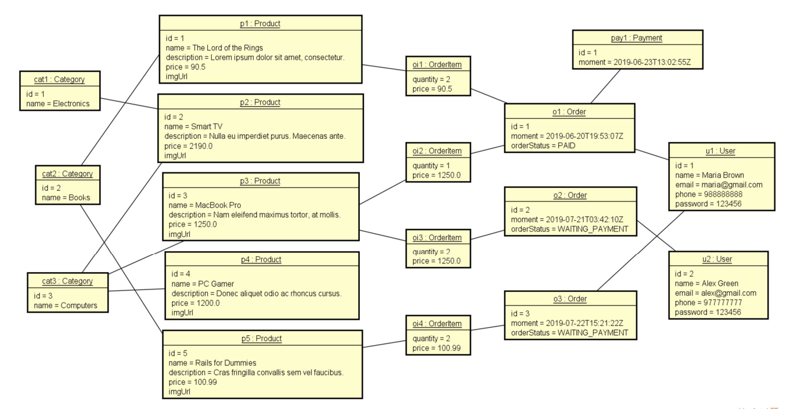

# Virtual Shop Back-End

Sistema de back-end de uma loja virtual com Spring Boot. 

# Sobre o projeto

Este projeto foi construído durante as aulas do curso de Java do professor Nelio Alves.

A aplicação consiste em um sistema back-end que contém as lógicas, relações, entidades e demais configurações básicas para uma loja virtual de compras.


# Tecnologias utilizadas
## Back end
- Java 17
- Spring Boot 3
- JPA / Hibernate
- Maven

## Modelo conceitual


# Como executar o projeto

## Back end
*Pré-requisitos: mesmas versões (ou mais atuais) do Java e Spring Boot instalados em sua máquina* <br>
Basta importar, através do Spring Tool Suite 4, um projeto Maven existente, selecionando o arquivo pom.xml deste repositório. <br>
Após isto, basta executar o arquivo ```CourseApplication.java``` que está localizado na pasta src/main/java, no pacote com.tucadev.course. <br>
Clique com o botão direito no arquivo, "Run As" -> "Spring Boot Aplication".

